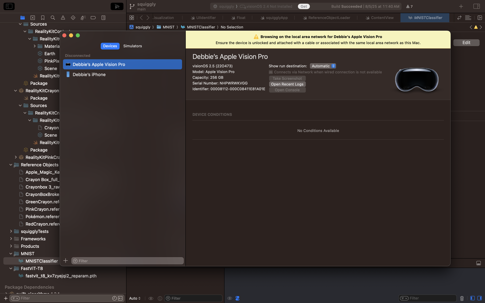
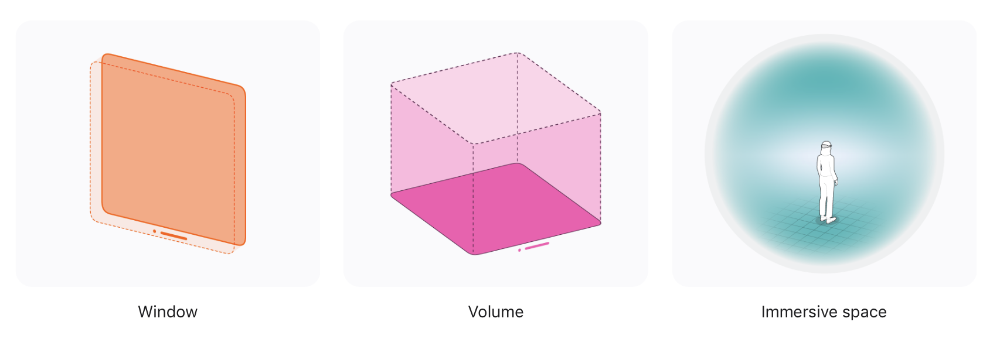

## Hands-On-Lab
import { Steps } from 'nextra/components'

Let's get started with the hands-on component! 
Next to each Apple Vision Pro, you will find a crayon box. If you do not have a crayon box or would like one, you may find extras at the front of the classroom. Or, raise your hand and one of the instructors will support.

With the Mac, the Apple Vision Pro, and the crayon box, we will take you through an artistic journey while learning exploring the space of predictive UI or UI Understanding. 

<iframe
  width="100%"
  height="420"
  src="https://youtu.be/ldZTil_zFnY"
  title="Demo video"
  frameBorder="0"
  allow="accelerometer; autoplay; clipboard-write; encrypted-media; gyroscope; picture-in-picture; web-share"
  allowFullScreen
/>

### Setting Up

<Steps>

### Step 1 — Fit the Apple Vision Pro
If you haven't already, put on the headset and adjust the straps. If you need support, please raise your hand.

### Step 2 — Open Xcode
On the MacBooks, the password is: `developer`. 
Navigate to `Documents/spatialui/squiggly/squiggly.xcodeproj` to open the XCode project. Alternatively, open **XCode** and open the `spatialui` folder.

### Step 3 — Launch the App
Once the project finishes compiling, and press **Run** to build to the Apple Vision Pro.  On the Apple Vision Pro, open **Squiggly**; you should see the welcome screen.

</Steps>
### Squiggly App 

Now that your Apple Vision Pro and the XCode project is set up, lets talk about the development and design of the app before diving into modfying the code and building to the headset! The Squiggly App is a demo app for learning purposes and is not a fully polished application. It is meant to be a starter project to support the visualization and imagination of machine learning and user interface design. 

Back to School season is here again. Take yourself all the way back to elementary school. It is art class and you and your classmates all have your own box of crayons. Try being creative and think of ways the user experience for physical-digital drawing can be. 

The goal of the Squiggly App is to not only explore the pipeline integration of machine learning when it comes to user interfaces in spatial contexts, but also to challenge the creative process of drawing in virtual reality. We begin with using our personal Photos Library for reference images to use while drawing. Then detecting crayon boxes and their individual crayons to draw in different colors then categorize the strokes patterns. 

The stroke pattern can then be exported and saved as package with 8 `.pngs` and 1 `.json` file. With 8 images taken from different views and a `.json` file, we can do more with our data such as creating a dataset, building a ML model, and creating a `.stl` file for 3D printing for example.

### Machine Learning
In the Squiggly app, machine learning was integrated in a number of different ways. In our [`https://github.com/debbieyuen/spatialui`](https://github.com/debbieyuen/spatialui) repository and submodule and the [`github.com/spatialui-ml`](https://github.com/debbieyuen/spatialui-ml/tree/02050baeb786eaf6aba0441131e44135935e450a) repository you will find the following models we are experimenting with: 

| Model           | Description                                          |
|----------------------|------------------------------------------------------|
| [Vision Framework]()      | Used with PhotoPicker as default model        |
| [FastViT]()     | Secondary model that can be subsituted to be used with PhotoPicker |
| [MNIST Dataset with CoreML]()| Used to categorize drawing strokes              | 
| [Squigglers Model]() (Custom) | All reference objects for object detection | Apple Vision Pro                       |
| [Squiggly Model]() (Custom)  | Image classification which will later on be integrated as multimodal with `.json` files              |

### 3D UI and Rendering
Entering into the Squiggly app, you will immediately see a welcome screen. This screen in visionOS is called a Window. In the Squiggly App, we work with **SwiftUI** and **UIKit** for flat UI and for 3D text, RealityView components. 

Metal by Apple is really great for rendering. However, in this project, we did not use Metal for our project and solely relied on Reality Composer Pro and __. 

* **Volumes:** 3D objects that allow people to view content from all angles. Volumes also create an experience that transitions fluidly from a 2D window into a more immersive scene with 3D content.
* **Windows:**
