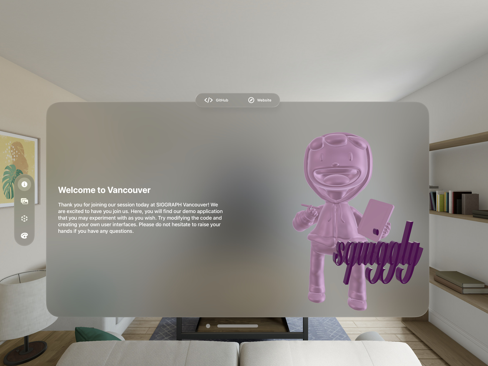
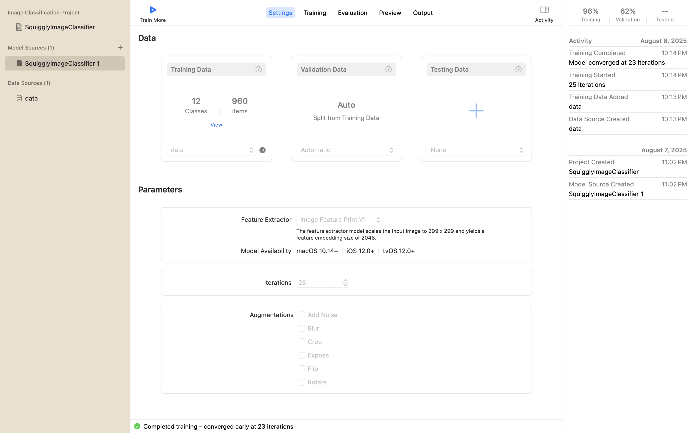

import { Callout } from 'nextra/components'

## Hands-On-Lab
import { Steps } from 'nextra/components'

Let's get started with the hands-on component! 
Next to each Apple Vision Pro, you will find a crayon box. If you do not have a crayon box or would like one, you may find extras at the front of the classroom. Or, raise your hand and one of the instructors will support.

With the Mac, the Apple Vision Pro, and the crayon box, we will take you through an artistic journey while learning exploring the space of predictive UI or UI Understanding. 

### Setting Up

<Steps>

### Step 1: Fit the Apple Vision Pro
If you haven't already, put on the headset and adjust the straps. If you need support, please raise your hand.

### Step 2: Open Xcode
On the MacBooks, the password is: `developer`. 
Navigate to `Documents/spatialui/squiggly/squiggly.xcodeproj` to open the XCode project. Alternatively, open **XCode** and open the `spatialui` folder.

### Step 3: Launch the App
Once the project finishes compiling, and press **Run** to build to the Apple Vision Pro.  On the Apple Vision Pro, open **Squiggly**; you should see the welcome screen.

Here is a screenshot of the home screen from the Apple Vision Pro simulator

</Steps>

### Squiggly App 

Now that your Apple Vision Pro and the XCode project is set up, lets talk about the development and design of the app before diving into modfying the code and building to the headset! The Squiggly App is a demo app for learning purposes and is not a fully polished application. It is meant to be a starter project to support the visualization and imagination of machine learning and user interface design. 

Back to School season is here again. Take yourself all the way back to elementary school. It is art class and you and your classmates all have your own box of crayons. Try being creative and think of ways the user experience for physical-digital drawing can be. 

The goal of the Squiggly App is to not only explore the pipeline integration of machine learning when it comes to user interfaces in spatial contexts, but also to challenge the creative process of drawing in virtual reality. We begin with using our personal Photos Library for reference images to use while drawing. Then detecting crayon boxes and their individual crayons to draw in different colors then categorize the strokes patterns. 

The stroke pattern can then be exported and saved as package with 8 `.pngs` and 1 `.json` file. With 8 images taken from different views and a `.json` file, we can do more with our data such as creating a dataset, building a ML model, and creating a `.stl` file for 3D printing for example.

### Machine Learning
In the Squiggly app, machine learning was integrated in a number of different ways. In our [`https://github.com/debbieyuen/spatialui`](https://github.com/debbieyuen/spatialui) repository and submodule and the [`github.com/spatialui-ml`](https://github.com/debbieyuen/spatialui-ml/tree/02050baeb786eaf6aba0441131e44135935e450a) repository you will find the following models we are experimenting with: 

| Model           | Description                                          |
|----------------------|------------------------------------------------------|
| [Vision Framework]()      | Used with PhotoPicker as default model        |
| [FastViT]()     | Secondary model that can be subsituted to be used with PhotoPicker |
| [MNIST Dataset with CoreML]()| Used to categorize drawing strokes              | 
| [Squigglers Model]() (Custom) | All reference objects for object detection | Apple Vision Pro                       |
| [Squiggly Model]() (Custom)  | Image classification which will later on be integrated as multimodal with `.json` files              |

Here is a screenshot of the Squiggly Image Classification model, created with CreateML.

### 3D UI and Rendering
When you open Squiggly, you land on a welcome screen inside a standard visionOS window. Our 2D interface is built with SwiftUI with a little bit of UIKit here and there. All 3D content—including 3D text and the drawing canvas—is rendered with RealityKit and presented via RealityView.

* **Volumes:** In the Squiggly app, we host 3D text, 3D models, and drawing entities inside a `RealityKit` scene that can be displayed as volumes. These 3D objects allow people to view content from all angles. Volumes also create an experience that supports transitions from a 2D window into a more immersive scene with 3D content and bounded 3D containers people can walk around and view from any angle. Volumes are useful for small 3D scenes, widgets, or models that sit statically in a room. 

* **Windows:** Windows are flat, 2D surfaces like traditional UI. They are perfect for toolbars, buttons, status text, and configuration panels. In the Squiggly app, you will see that the main section is a window itself. 

* **Immersive Spaces:** Immersive spaces are full-environment experiences that surround the user. They are ideal for focused, spatial tasks without the constraints of a window frame. In Squiggly, the painting and object detection mode takes place within an immersive space. In this way, strokes feel anchored to the room and space rather than on a flat plane. 

We don’t use Metal directly in this project. Instead, assets are authored in Reality Composer Pro and rendered by RealityKit at runtime. Metal is great for custom render pipelines and shaders, but Squiggly relies on RealityKit. RealityKit already gives us performant, GPU-accelerated rendering plus physics, lighting, and materials out of the box.
The materials we use are simple and the defaults with as `Unlit/PhysicallyBased` over custom shaders.

<Callout type="info" emoji="💡">
  <strong>Note:</strong> If you’re comparing approaches, use RealityKit and Reality Composer Pro when you want fast iteration with Apple’s scene tools. Use Metal when you need custom shading, compute kernels, or fine-grained control over the render graph.
</Callout>

* **Authoring:** 3D assets are created and edited in Reality Composer Pro and added to the Xcode project as `.reality` files.
* **Presentation:** A RealityView hosts the scene and manages entities (strokes, guides, and 3D text).
* **Snapshots:** We use an off-screen RealityKit renderer to capture square images from fixed camera poses (front/back/left/right/top/bottom/oblique1/oblique2). These export as 640×640 PNGs alongside the JSON stroke data. The stroke data is then compiled into a dataset then trained in CreateML.

