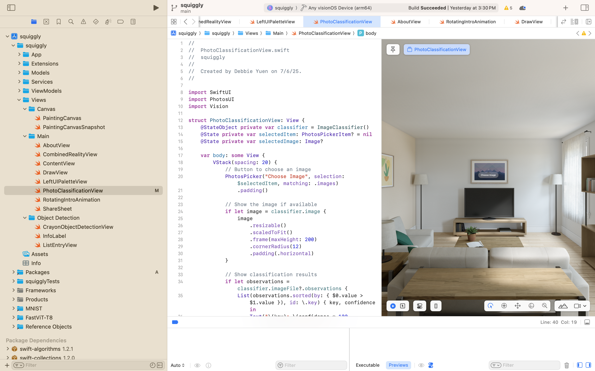
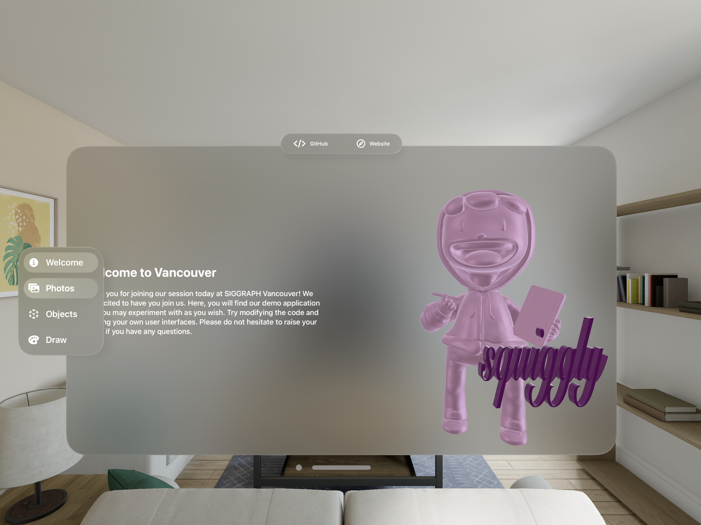
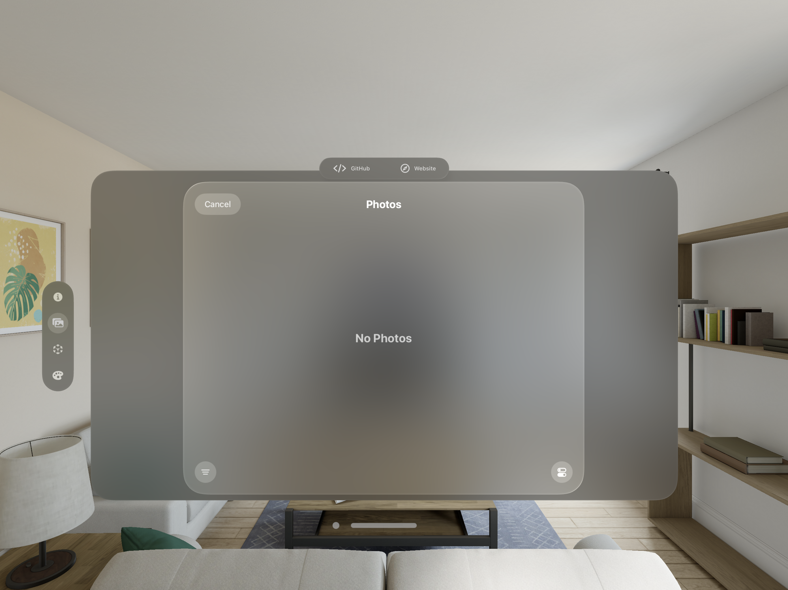

import { Steps } from 'nextra/components'
import { Callout } from 'nextra/components'

# User Interface

## Overview

## Getting Started 
<Steps>

### Step 1: PhotoClassificationView.swift
The project's folder structure is broken up into MVVM (Model-View-ViewModel) architecture. Navigate to `squiggly/Views/Main/PhotoClassificationView.swift`.

### Step 2: Photos Tab in Toolbar
On the Apple Vision Pros, you will find the toolbar on the left. In this window, we have 3 toolbars including the left toolbar, bottom toolbar, and the top ornament. Select the `Photos` Tab to open up the tab. 

### Step 3: Choose Photo
Once you are in the tab, you may try choosing a photo of your choice to classify. By default we are using Apple's built-in Vision Framework with `VNClassifyImageRequest()`. 

</Steps>

## User interfaces

Navigating to the **Packages** folder in XCode, we can find our Reality Composer Pro project files. In the screenshot below, we can visualize the 3D model of our Pixel character. Underneath the 3D model, there is a **Package** file in which you may then open the project in Reality Composer Pro. 

### Reality Composer Pro

In the following example, we open up the **RealityKitCrayonBoxContent** that holds the information for object detection with the 3D crayon box. To overlay UI over the crayon box, we configured it in Reality Composer Pro by creating a new `Transform` object and attaching an `Anchor` with an `Object` target. 

### User interfaces

Now that we have anchors on the 3D reference objects, we are able to write in code to overlay UI. In our case, we used SwiftUI to overlay UI over the crayon box. 

How did we create anchors to the wrist? The anchor for the wrist was created in code; however, this can also be done in Reality Composer Pro as well. Instead of selecting `Object` as the target, select `Hand`.

How does SwiftUI, UIKit, and RealityKit go together? 

### RealityView

### Glass Effect visionOS 
Liquid glass verus glass effect visionOS

