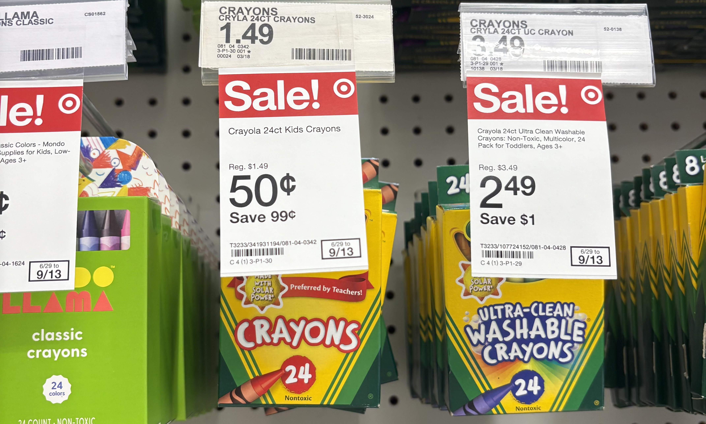

# User Interface

## Overview

An image classifier is a machine learning model that recognizes images. When you give it an image, it responds with a category label for that image. You train an image classifier by showing it many examples of images you’ve already labeled. For example, you can train an image classifier to recognize animals by gathering photos of elephants, giraffes, lions, and so on. After the image classifier finishes training, you assess its accuracy and, if it performs well enough, save it as a Core ML model file. You then import the model file into your Xcode project to use the image classifier in your app. CreateML is a tool that we will be using to support us through this process.

## Getting Started 
First lets start off with picking a 3D model. In our case, we got 24 count crayon boxes from Target. Luckily, they are on sale for 0.50 cents (USD)!!

