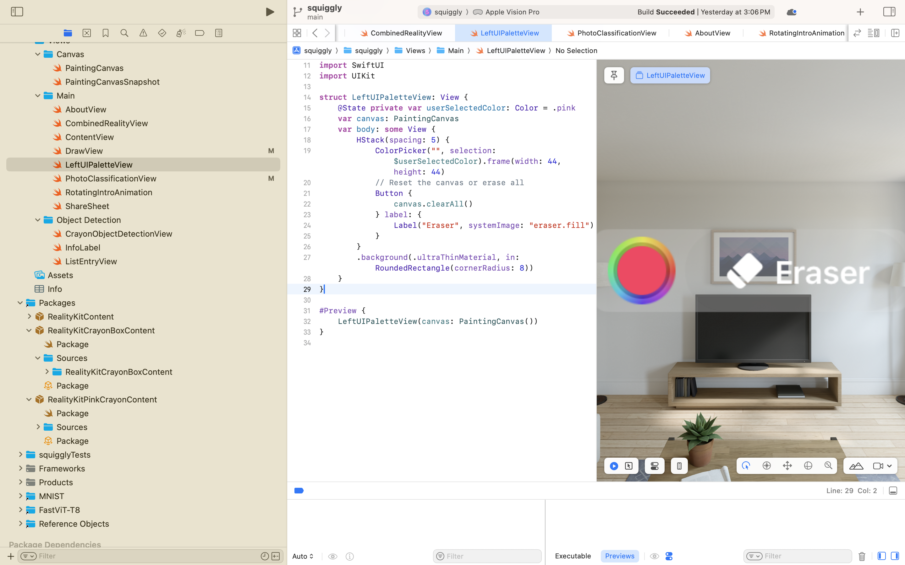
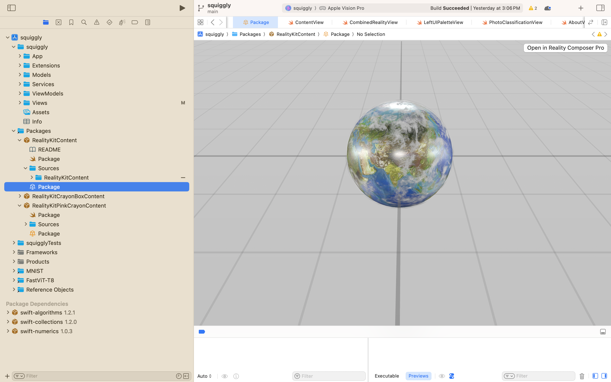
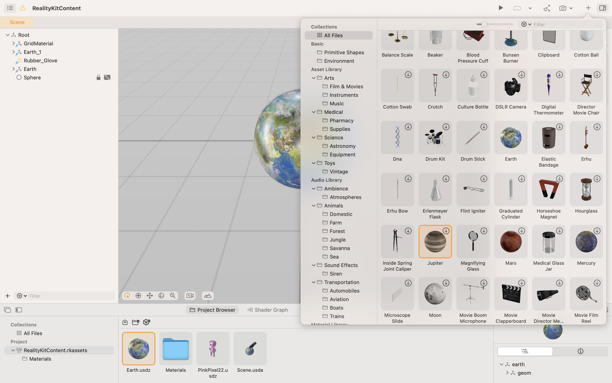
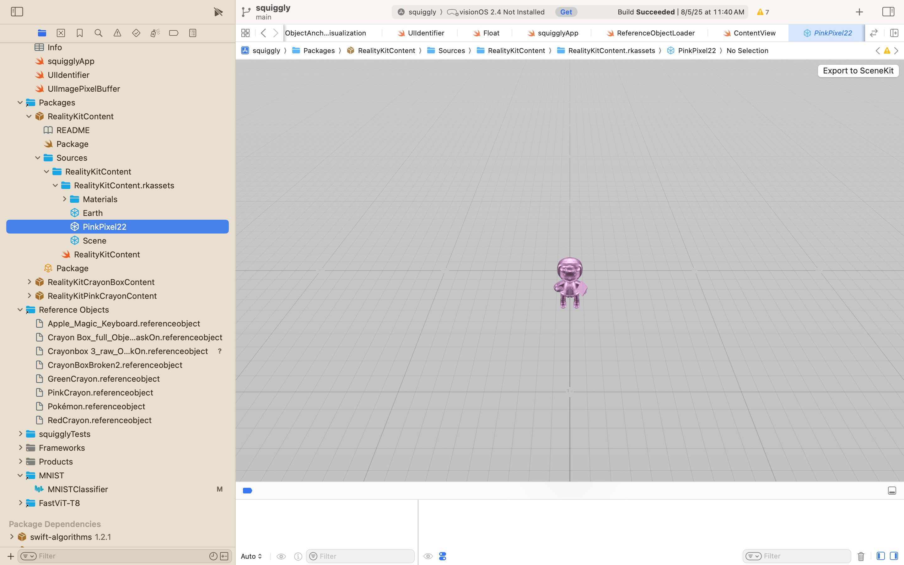
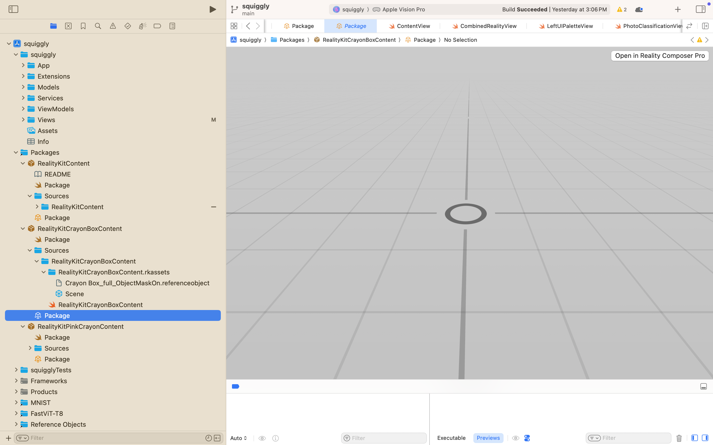
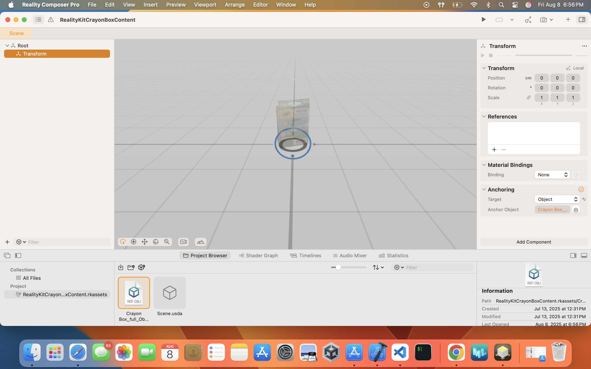
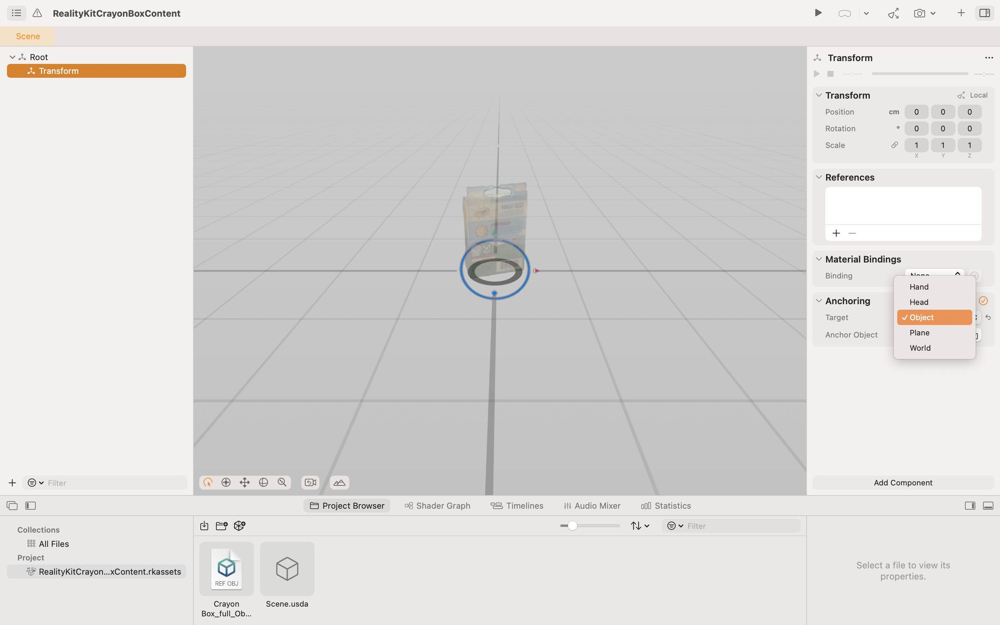
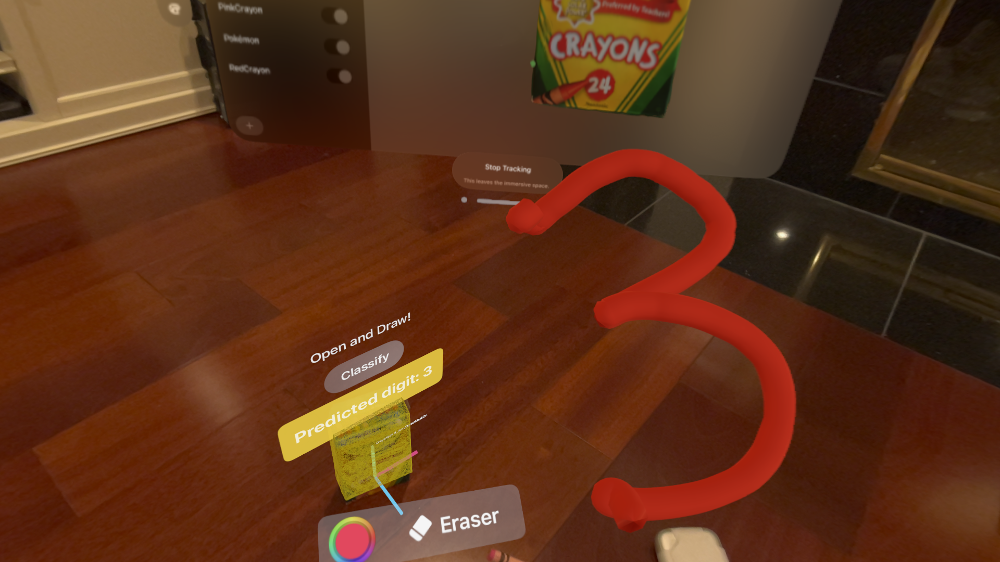
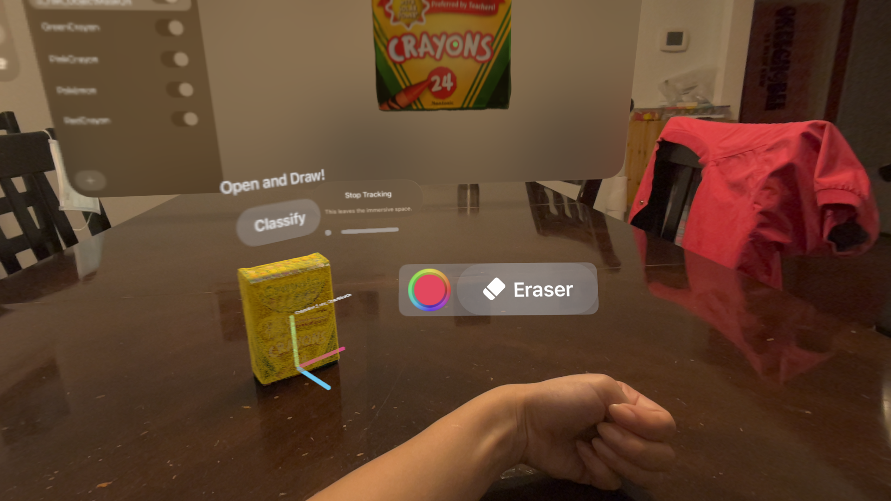

import { Steps } from 'nextra/components'
import { Callout } from 'nextra/components'

# User Interface

## Getting Started 
<Steps>

### Step 1: LeftUIPaletteView.swift
In XCode or on GitHub, navigate to `LeftUIPaletteView.swift`.



### Step 2: Add Button to Left Hand Anchor
How did we create a hand attachment to our left hand? Lets try looking at the code. 
Modify the menu to add a new SwiftUI element such as a `Button`.

Here is an example of a minimal SwiftUI button with text and an SF Symbol icon. 

```swift filename="LeftUIPaletteView.swift" copy
// Create Classify Button
    Button {
        print("Welcome to SIGGRAPH Labs")
    } label: {
        Label("Classify", systemImage: "bolt.circle")
    }
```

### Step 3: DrawView.swift
Uncomment the code in `DrawView.swift`. The code here includes an example of displaying 3D objects such as 3D text and 3D models in `RealityView`. 

### Step 4: Reality Composer Package
In XCode, we would like to open the Reality Composer Project that holds our 3D models. Navigate to `swiggly/Packages/RealityKitContent/Sources/Package.realitycomposerpro`. In the Squiggly App, the **Packages** folder in XCode, we can find our Reality Composer Pro project files. Underneath each section, there is a **Package*.realitycomposerpro* file in which you may then open the corresponding project in Reality Composer Pro. 



Click on `Open in Reality Composer Pro`. A new window should open. In the top right corner, click on the `+` button to choose a 3D model. Make sure to add it to your project and that it shows up in your **Project Browser**.



### Step 5: Replace Model
Navigating back to XCode, replace the 3D model of SIGGRAPH's mascot, Pixel, in your code. You can find your assets in `squiggly/Packages/RealityKitContent/RealityKitContents.rkassets`. In the screenshot below, we can visualize the 3D model of our Pixel character. 



</Steps>

## Hand Detection and Gestures
Squiggly uses Apple’s hand-tracking APIs to detect when you pinch, tap, or perform other gestures in mid-air. This lets you draw, select tools, and interact with 3D elements without needing controllers.

## Eye Tracking
With visionOS eye-tracking, Squiggly can highlight objects or UI elements as you look at them, making interactions more natural. Your gaze can be combined with gestures to confirm selections, keeping your workflow smooth and hands-free.

## Object Detection Anchoring
In Squiggly, reference objects let the app recognize and track real-world items—like crayons—so we can anchor 3D drawings in the correct position in space.

### Method 1: Reality Composer Pro

<Callout type="info" emoji="💡">
  <strong>Note:</strong> Want to learn more? Read more about using a reference object with Reality Composer Pro <strong><a href="https://developer.apple.com/documentation/visionos/using-a-reference-object-with-reality-composer-pro">here</a></strong>!
</Callout>

Open up the **RealityKitCrayonBoxContent** that holds the information for object detection with the 3D crayon box. To see how we added UI anchors to our crayon box, navigate to `squiggly/Packages/RealityKitCrayonBoxContent/Sources/Package` and open in **Reality Composer Pro**


Use Reality Composer Pro to import your `.referenceobject` files. Once added, they can be placed directly into your scene with drag-and-drop simplicity. This is how Squiggly app implemented object anchoring. 

To overlay UI over the crayon box, we configured it in Reality Composer Pro by creating a new `Transform` object.


Then we and attached an `Anchor` with an `Object` target. 


Now that we have anchors on the 3D reference objects, we are able to write in code to overlay UI. In our case, we used SwiftUI to overlay UI over the crayon box. 


### Method 2: Programmatically 
Load reference objects in Swift code using RealityKit. This allows you to dynamically choose which object to track at runtime, enabling advanced features like switching between multiple tracked objects.

<Callout type="info" emoji="💡">
  <strong>Note:</strong> Want to learn more? Read more about using a reference object with RealityKit <strong><a href="https://developer.apple.com/documentation/visionos/using-a-reference-object-with-realitykit">here</a></strong>!
</Callout>

How did we create anchors to the wrist? The anchor for the wrist was created in code. 


### Method 3: ARKit
For lower-level control, Squiggly can use ARKit’s `ARReferenceObject` APIs. This is ideal if you need custom detection logic or want to integrate with AR session configuration directly.

<Callout type="info" emoji="💡">
  <strong>Note:</strong> Want to learn more? Read more about using a reference object with ARKit <strong><a href="https://developer.apple.com/documentation/visionos/using-a-reference-object-with-arkit">here</a></strong>!
</Callout>

