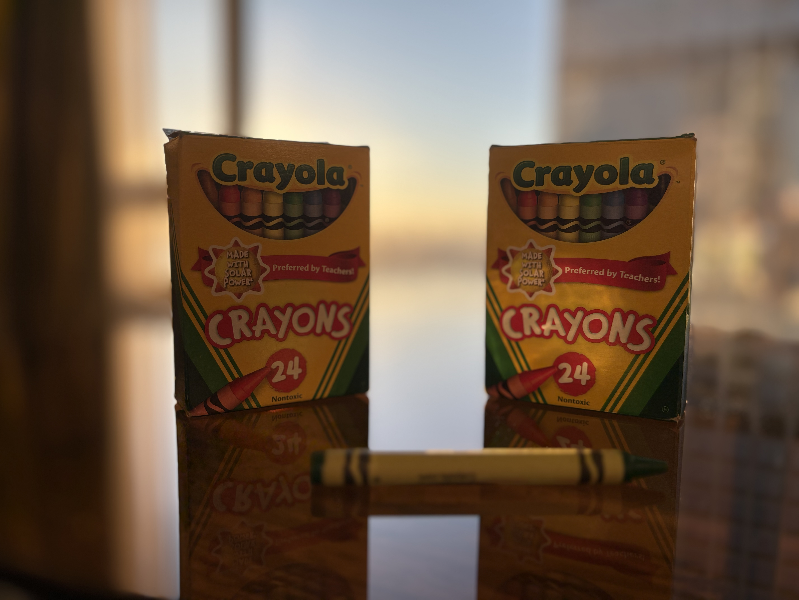
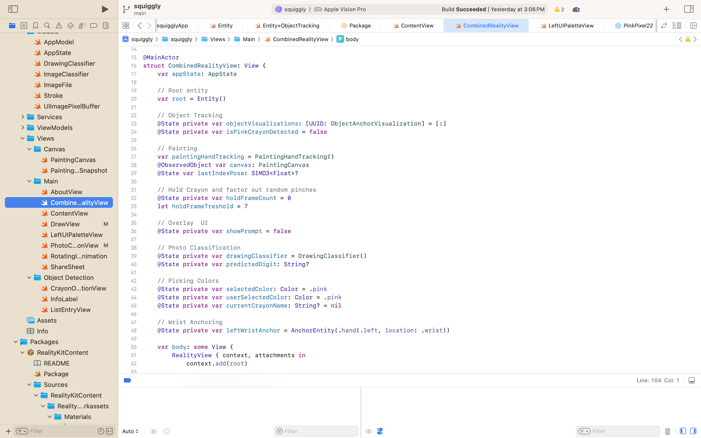
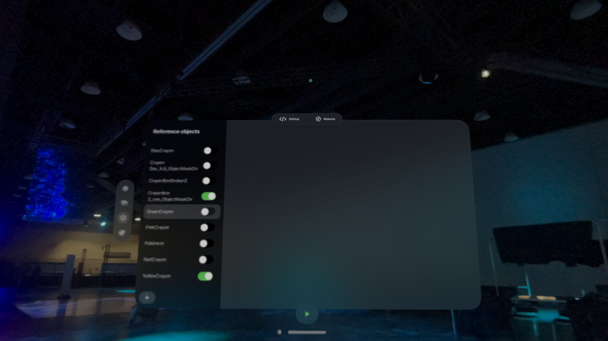
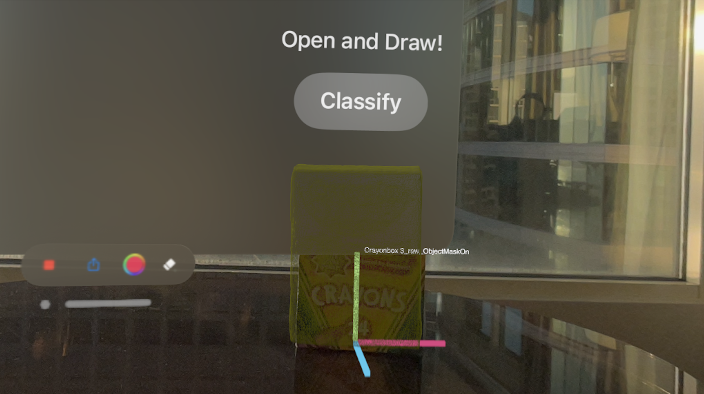
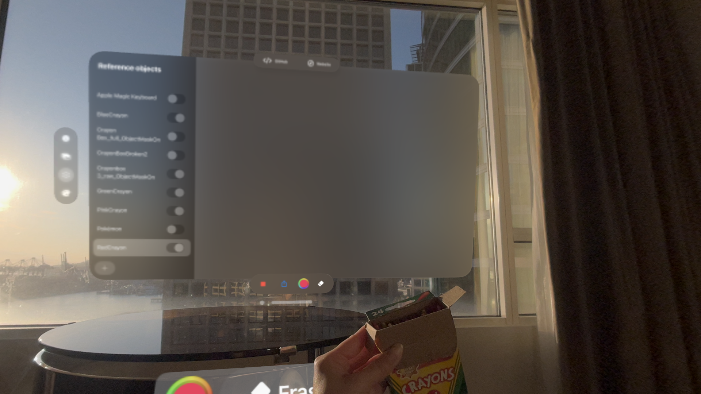
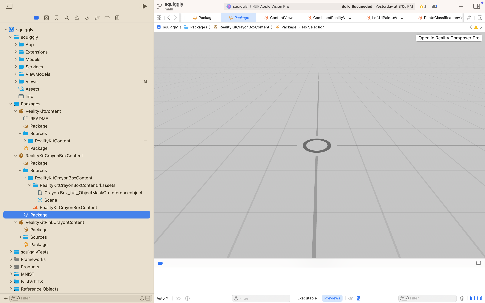

import { Steps } from 'nextra/components'
import { Callout } from 'nextra/components'

# Object Detection



## Getting Started 
<Steps>

### Step 1: CombinedRealityView.swift
Navigate to `squiggly/Views/Main/CombinedRealityView.swift`. This is where the code for the immersive space is. 



### Step 2: Object Tab in Toolbar
On the Apple Vision Pros, you will find the toolbar on the left. In this window, we have 3 toolbars including the left toolbar, bottom toolbar, and the top ornament. In the left toolbar, select the `Objects` Tab to open up the section. 

### Step 3: Select Objects to Detect
Once you are in the tab, you will find a `NavigationSplitView`. Try cycing through the objects in which you will see we trained 3 crayon boxes and some of its individual crayons. For our course today, we will focus only on the Crayon Box. Please deselect all objects except for `Crayonbox 3_raw_ObjectMaskOn`.



### Step 4: Detect Crayon Box
Then click on the green `Play` button in the bottom toolbar. The bottom toolbar will then change into a different UI as you enter into the immersive space. Now, find your crayon box on your table. When detected, you should see a yellow overlay with a UI overlay. 



The box changes shape when it is opened. For best results, cover the face of the crayon box with the tabs.


</Steps>

## Overview

An image classifier is a machine learning model that recognizes images. When you give it an image, it responds with a category label for that image. You train an image classifier by showing it many examples of images you’ve already labeled. For example, you can train an image classifier to recognize animals by gathering photos of elephants, giraffes, lions, and so on. After the image classifier finishes training, you assess its accuracy and, if it performs well enough, save it as a Core ML model file. You then import the model file into your Xcode project to use the image classifier in your app. CreateML is a tool that we will be using to support us through this process.

## Reference Objects
In this section, we share this process was implemented. First we started off by picking a 3D model. In our case, we got 24 count crayon boxes from Target. Luckily, they are on sale for 0.50 cents (USD)!!


There are a number of different ways we can gather data on our crayon box. 
* If you are on an iPhone Pro (iPhone 12, 14, 15, 16) you may use Apple's [Reality Composer]() iOS app or download their [Object Capture]() application. 
* If you do not have an iPhone, you may take at minimum 10 photos of your item. It is recommended to take between 50-100 photos for each object. Then, on [Reality Composer Pro]() we can compile the images and create a 3D model. 
* Alternatively, we can use other applications such as [PolyCam](), [Luma3D](), and [Abound]().

Other than our crayon box, we experimented with training individual crayons, the Ardunio UNO, stuffed animals, Raspberr Pi Pico, and whiteboard Expo markers. 


If you are working with a set of images, you may open up [Reality Composer Pro]() on the Mac and select **Create New Object Capture Model**. From there, a 3D model in a `.usdz` format will be created for you. You may also use existing 3D models, just make sure they are in `.usdz` format. 


Next, we can bring in our *.usdz* file into [CreateML](). It is important to make sure the objects are in the right dimensions in `cm`. If the dimensions are incorrect, you may modify them in a 3D modeling software such as [Blender]().


Finally, you can start training! It is expected to take some time. Once it is complete, you may export it as a **Reference Object** in `.referenceobject` format. Once you have your reference object, you may place the reference objects into your XCode project under the a folder named `Reference Objects`.


The reference objects selected for this project were a bit small. Creating a 3D model of small objects such as crayons and markers were difficult, especially with the object capture application. Taking individual photos of the crayons and then processing the photos in Reality Composer Pro also was difficult. 


After creating the reference objects, we are then able to add them to our **Reference Images** folder. From there, we will see our reference objects appear in our UI. 


### Hand Detection and Gestures
Squiggly uses Apple’s hand-tracking APIs to detect when you pinch, tap, or perform other gestures in mid-air. This lets you draw, select tools, and interact with 3D elements without needing controllers.

### Eye Tracking
With visionOS eye-tracking, Squiggly can highlight objects or UI elements as you look at them, making interactions more natural. Your gaze can be combined with gestures to confirm selections, keeping your workflow smooth and hands-free.

### Object Detection Anchoring
In Squiggly, reference objects let the app recognize and track real-world items—like crayons—so we can anchor 3D drawings in the correct position in space.

#### Method 1: Reality Composer Pro
Use Reality Composer Pro to import your `.arobject` or `.referenceobject` files. Once added, they can be placed directly into your scene with drag-and-drop simplicity. This is how Squiggly app implemented object anchoring. 

<Callout type="info" emoji="💡">
  <strong>Note:</strong> Want to learn more? Read more about using a reference object with Reality Composer Pro <strong><a href="https://developer.apple.com/documentation/visionos/using-a-reference-object-with-reality-composer-pro">here</a></strong>!
</Callout>

To see how we added UI anchors to our crayon box, navigate to `squiggly/Packages/RealityKitCrayonBoxContent/Sources/Package` and open in **Reality Composer Pro**


In Reality Composer Pro, we had added a `Transform` with an **Object** anchor.


#### Method 2: Programmatically 
Load reference objects in Swift code using RealityKit. This allows you to dynamically choose which object to track at runtime, enabling advanced features like switching between multiple tracked objects.

<Callout type="info" emoji="💡">
  <strong>Note:</strong> Want to learn more? Read more about using a reference object with RealityKit <strong><a href="https://developer.apple.com/documentation/visionos/using-a-reference-object-with-realitykit">here</a></strong>!
</Callout>

#### Method 3: ARKit
For lower-level control, Squiggly can use ARKit’s `ARReferenceObject` APIs. This is ideal if you need custom detection logic or want to integrate with AR session configuration directly.

<Callout type="info" emoji="💡">
  <strong>Note:</strong> Want to learn more? Read more about using a reference object with ARKit <strong><a href="https://developer.apple.com/documentation/visionos/using-a-reference-object-with-arkit">here</a></strong>!
</Callout>

### Local vs Cloud
All models used in the Squiggly app are using local models. For our learning purposes, we wanted to make sure the projects were able to run even without WiFi. 

you can run machine learning models either locally or in the cloud. When running locally, the Core ML model is downloaded to your device, allowing the app to work completely offline with low and consistent latency. All images stay on the headset, which means your data never leaves the device, making this option ideal for real-time interactions, privacy, and demos. However, the model size is limited by the app package and the computing power of the device.

```swift filename="ImageClasifier.swift" {6} copy
let request = VNClassifyImageRequest()
        let handler = VNImageRequestHandler(cgImage: cgImage, options: [:])

        do {
            try handler.perform([request])
            if let results = request.results as? [VNClassificationObservation] {
                for classification in results {
                    file.observations[classification.identifier] = classification.confidence
                }
            }
        } catch {
            print("Vision error: \(error)")
        }

console.log(a);
```

When running in the cloud, Squiggly sends snapshots to a Hugging Face endpoint where the model is hosted. This allows you to use larger or frequently updated models without having to ship a new app build. It does require an internet connection, and performance depends on network speed. Cloud inference is useful for rapid iteration, A/B testing, or when using architectures too large for on-device execution. By default, Squiggly runs locally, but if confidence in a classification is low or the local model isn’t available, it can automatically fall back to the Hugging Face cloud option. You can also manually switch between local and cloud inference in the app’s settings

Here is an example of running a model from Pytorch from Hugging Face. If you are running `.mlmodels` you can’t load it with transformers. Instead, run it with Core ML which means Swift (iOS/macOS) or Python via coremltools. Read more [here](https://huggingface.co/docs/trl/en/use_model).

```swift filename="CloudModelExample.swift" {3} copy
from transformers import AutoImageProcessor, AutoModelForImageClassification
from PIL import Image

model_name_or_path = "debbieyuen/squiggly"  # your model on Hugging Face
device = "cpu"  # or "cuda" if you have a GPU

processor = AutoImageProcessor.from_pretrained(model_name_or_path)
model = AutoModelForImageClassification.from_pretrained(model_name_or_path).to(device)

image = Image.open("test.png")
inputs = processor(images=image, return_tensors="pt").to(device)

outputs = model(**inputs)
predictions = outputs.logits.softmax(dim=-1)
predicted_class = predictions.argmax(dim=-1).item()

print(model.config.id2label[predicted_class])


```
