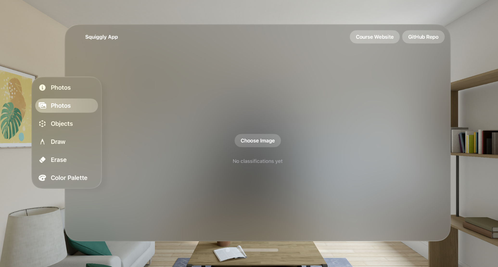

# Photo Classification

## Overview

In the Squiggly App, image classifiers played essential roles in categorizing. Through Apple's image classifier with CreateML, machine learning models can be created to recognize images. The Squiggly App also explores the FastViT model and the Vision Framework in how they categorize images. 

Navigate to the toolbar on the right hand side and find **Photo Classification**. The Squiggly App by default runs the image classifier model, Vision Framework. Click on the **Select Image** button in which it will pull up a pop-up to open up **Photo Picker** to selct images from the Photo Library. When fed an image, the model will respond with a category label for the image. Image classifiers are trained by showing it many examples of labeled images. In this case, we are using a trained image classifier to recognize an image of a selectedd photo. 

## PhotoPicker

## Machine Learning Models
### FastVit
### Apple Vision Framework 
## Custom Image Classifier (CreateML)
As a drawing app, we are able to draw strokes of our choice. Later we will discuss how to create a custom image classifier model. 

You train an image classifier by showing it many examples of images you’ve already labeled. For example, you can train an image classifier to recognize animals by gathering photos of elephants, giraffes, lions, and so on. After the image classifier finishes training, you assess its accuracy and, if it performs well enough, save it as a Core ML model file. You then import the model file into your Xcode project to use the image classifier in your app. CreateML is a tool that we will be using to support us through this process.
