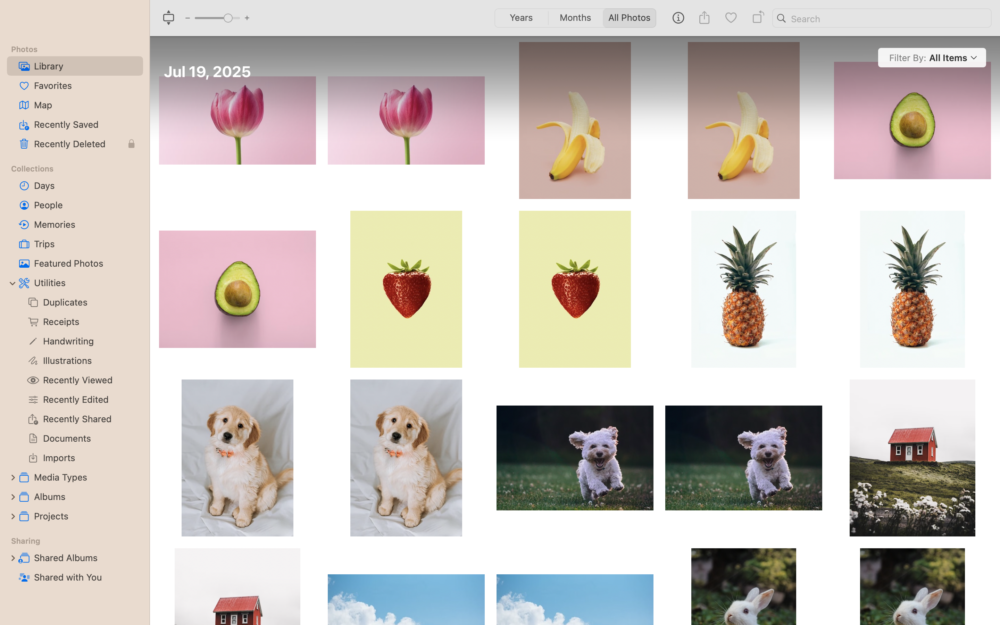
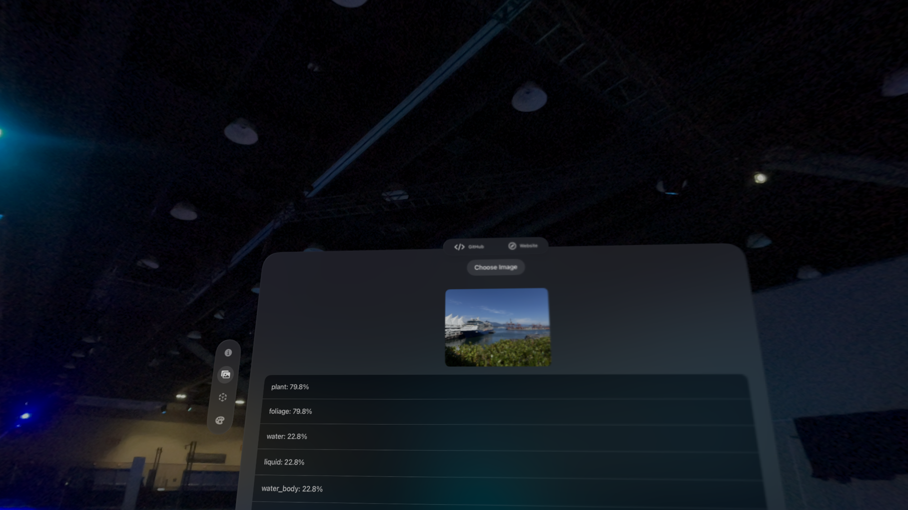

import { Steps } from 'nextra/components'
import { Callout } from 'nextra/components'

# Photo Classification

## Getting Started 
<Steps>

### Step 1: PhotoClassificationView.swift
The project's folder structure is broken up into MVVM (Model-View-ViewModel) architecture. Navigate to `squiggly/Views/Main/PhotoClassificationView.swift`.

### Step 2: Photos Tab in Toolbar
On the Apple Vision Pros, you will find the toolbar on the left. In this window, we have 3 toolbars including the left toolbar, bottom toolbar, and the top ornament. Select the `Photos` Tab to open up the tab. 

### Step 3: Choose Photo
Once you are in the tab, you may try choosing a photo of your choice to classify. By default we are using Apple's built-in Vision Framework with `VNClassifyImageRequest()`. 

In your Photos library, you should see 10 images. Here is an example from Debbie's Photo's library. 

### Step 4: Run `VNClassifyImageRequest()`
Once you select a photo, `VNClassifyImageRequest` will analyze it and return the predicted classifications.
This Vision framework request analyzes the visual content and returns a ranked list of possible classifications, each with an associated confidence score. You’ll see the top predictions displayed, allowing you to verify if the model correctly identified the subject in your photo.

</Steps>

## Overview

In the Squiggly App, image classifiers played essential roles in categorizing. Through Apple's image classifier with CreateML, machine learning models can be created to recognize images. The Squiggly App also explores the FastViT model and the Vision Framework in how they categorize images. By default, the project is using `VNClassifyImageRequest()` but feel free to try swapping it out for another model. 

Navigate to the toolbar on the right hand side and find **Photo**. The Squiggly App by default runs the image classifier model, Vision Framework. Click on the **Choose Image** button in which it will pull up a pop-up to open up **Photos** to selct images from the Photo Library. When fed an image, the model will respond with a category label for the image. Image classifiers are trained by showing it many examples of labeled images. In this case, we are using a trained image classifier to recognize an image of a selectedd photo. 

<Callout type="info" emoji="🖍️">
  <strong>TODO:</strong> Try investigating the FastVit model. How does it compare to Apple's Vision Framework? How are they differen in terms of how you would import the models in the project? 
</Callout>

## PhotoPicker
In Squiggly, the PhotoPicker lets you import your own images from the photo library. This can be useful for testing the app’s machine learning features with custom drawings or comparing your sketches against saved references.

## Machine Learning Models
Squiggly uses on-device Core ML models to recognize and categorize your 3D-drawn strokes in real time. You can switch between different models to see how each interprets your creations.

### FastVit
FastViT is one of the models in Squiggly’s toolkit, designed for speed and efficiency. It quickly processes your drawing snapshots from multiple angles so you get near-instant classification results.

### Apple Vision Framework 
The Apple Vision Framework is the default in the Squiggly app. It brings the ability to detect features, track your drawn strokes, and prepare the data for the ML models. It ensures that what you draw is accurately captured before analysis.

## Custom Image Classifier (CreateML)
As a drawing app, we are able to draw strokes of our choice. Later we will discuss how to create a custom image classifier model. 

With CreateML, you can train an image classifier by showing it many examples of images you’ve already labeled. For example, you can train an image classifier to recognize animals by gathering photos of elephants, giraffes, lions, and so on. After the image classifier finishes training, you assess its accuracy and, if it performs well enough, save it as a Core ML model file. You then import the model file into your Xcode project to use the image classifier in your app. CreateML is a tool that we will be using to support us through this process.
