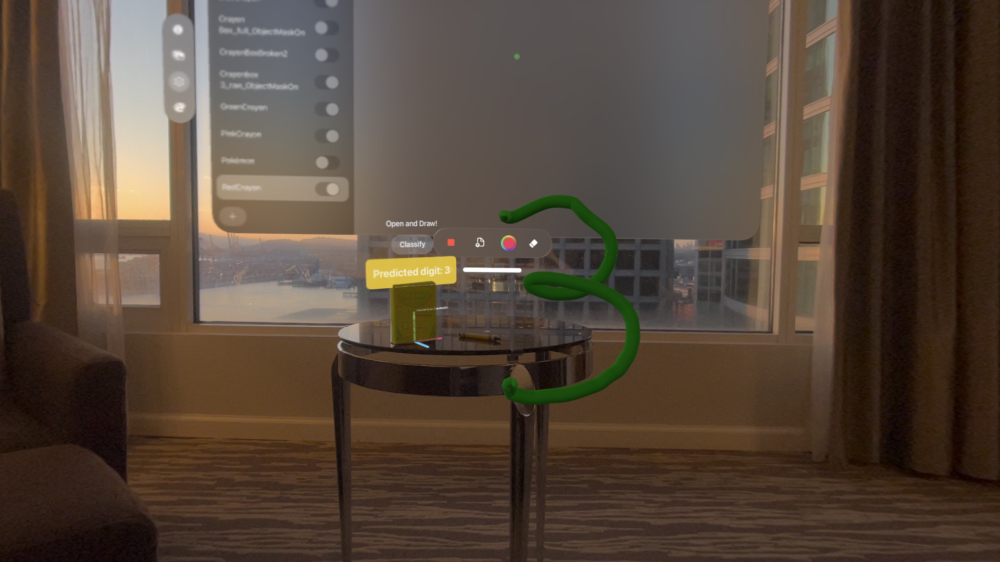
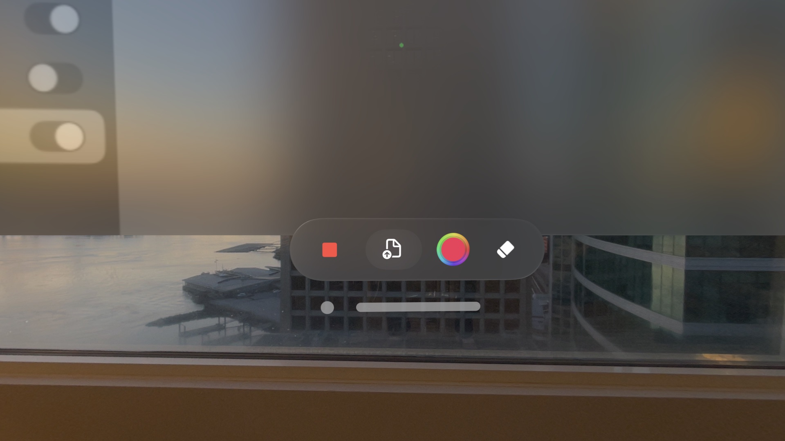
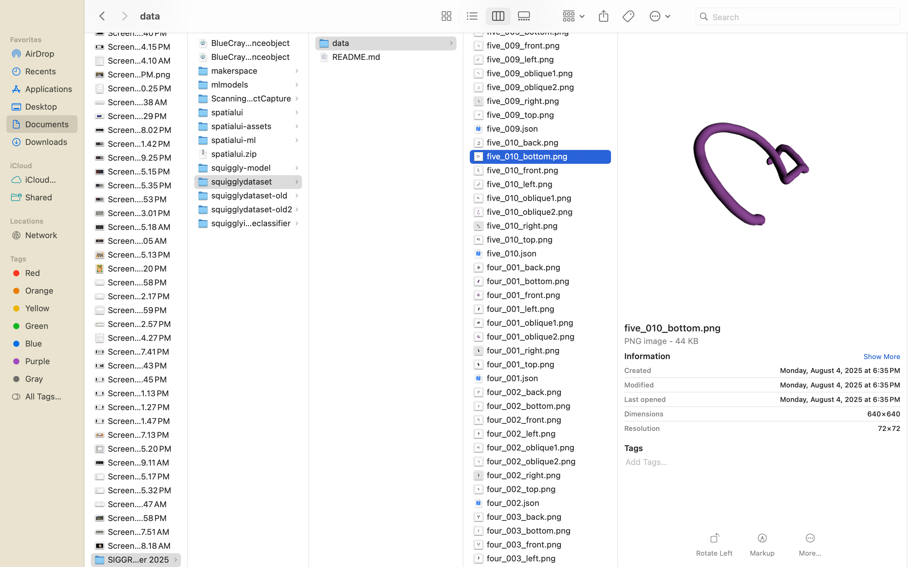
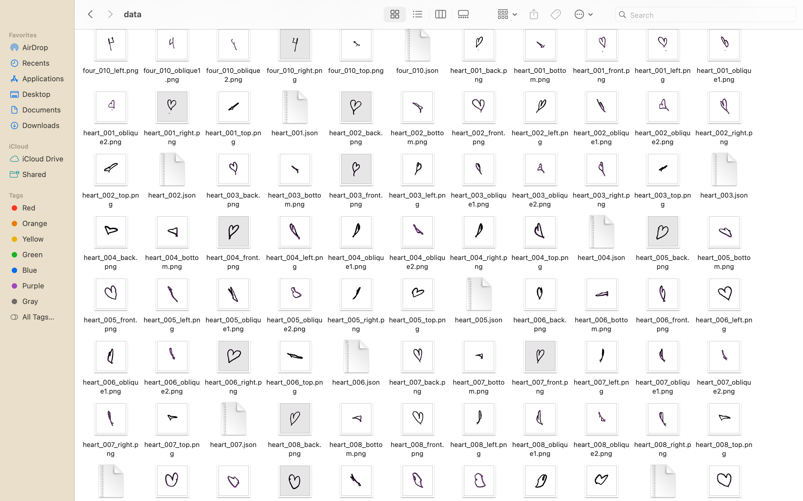
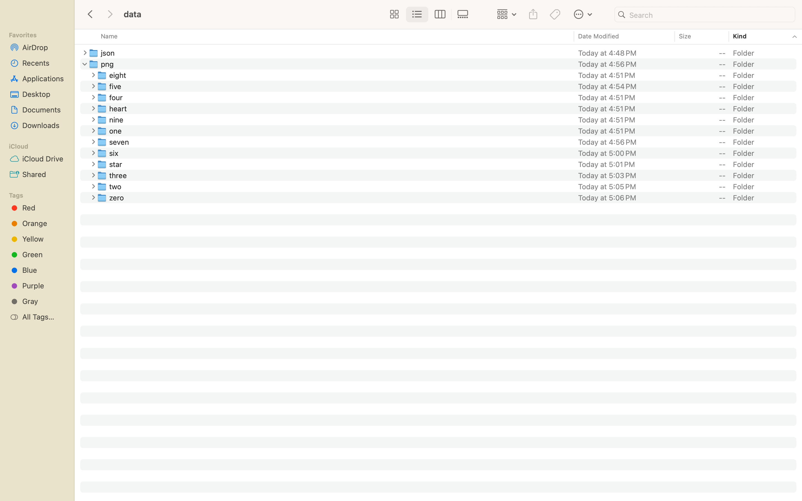
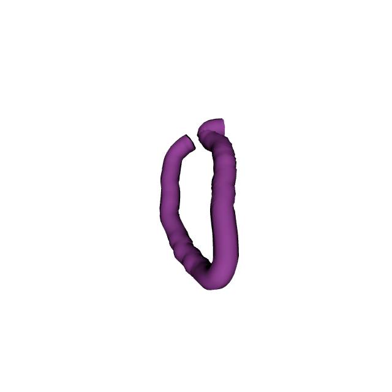
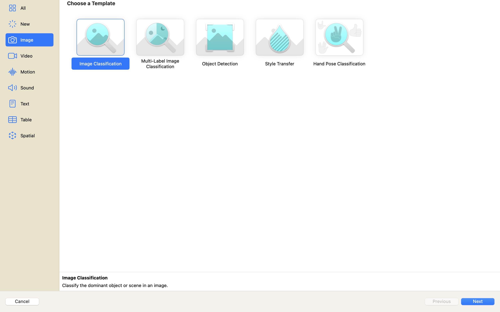
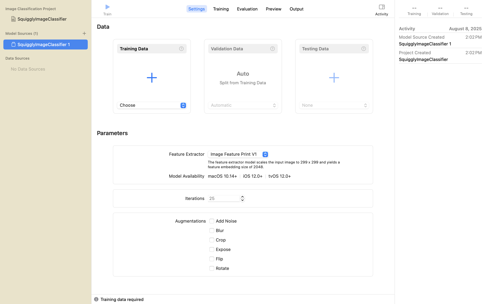
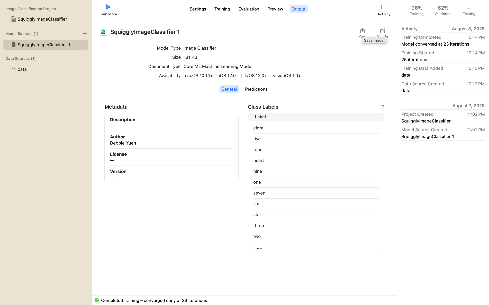

import { Steps } from 'nextra/components'
import { Callout } from 'nextra/components'

# Stroke Classification

This section outlines the development process for drawing stroke classification. The Squiggly App defaults to using the MNIST dataset for drawing digits and then shares the process of creating a custom CoreML model for 3D drawing strokes. 

Since the crayon objects were trained accordingly to its colors, it is ideal to test crayon object detection in brightly lit rooms or spaces and to select one crayon at a time to ensure focus. 

Before you begin crayon object detection, it is important to note that the crayon needs to be held a certain way to begin drawing. Instead of using live camera access, we are using a combination of crayon object detection and hand tracking. To successfully detect that your hands are in the correct gesture to trigger drawing strokes, hold the crayon as if you are writing with a pencil. The **index finger** should be in contact with the **thumb** like a pinch. To stop drawing, open up your hand to release the pinch gesture. 

<iframe width="100%" height="500" src="https://www.youtube.com/embed/zMgo2bp3CtU?si=Ym85uXQc6n8Y9fxT" title="YouTube video player" frameborder="0" allow="accelerometer; autoplay; clipboard-write; encrypted-media; gyroscope; picture-in-picture; web-share" referrerpolicy="strict-origin-when-cross-origin" allowfullscreen></iframe>

To start drawing with the crayons, we need to detect a physical crayon from the crayon box. In our application, the colors: **Dark Green, Pink, Blue, Red, and Yellow** should work. If you are interested in seeing addiitional crayon colors and their `.referenceobjects`, please check out our HuggingFace model repository. 

For our example, lets select the **Yellow Crayon** from the crayon box. Take out the crayon and lay it horizontally on a flat surface. Focus on the crayon and roll the crayon onto different sides it not detecting immediately. Once the overlay displays, immediately pick up the crayon to start drawing. The code is set to begin drawing after 7 frames, so it might take a moment to begin. 

To change colors, put the crayon back into the crayon box and detect another crayon color such as **Pink Crayon**. The stroke colors are determined based on the last crayon object detected. 

<iframe width="100%" height="500" src="https://www.youtube.com/embed/ldZTil_zFnY?si=GtthVT0inyP1NJHh" title="YouTube video player" frameborder="0" allow="accelerometer; autoplay; clipboard-write; encrypted-media; gyroscope; picture-in-picture; web-share" referrerpolicy="strict-origin-when-cross-origin" allowfullscreen></iframe>

On your left hand, you will find an anchored UI menu with an eraser button. User one finger to tap to erase. 

Next, try drawing some digits. In our experience, drawing the `number 3` gives the best results with the MNIST dataset. 

Once you are done, you may click on the `Export/File Share` button. Clicking on the the button the first time takes `eight .pngs` and `one .json` file of your drawing. The 8 snapshots are automatically taken with a virtual camera and then rendered with texture and lighting to make it look three-dimensional. 

Preparing the dataset depends on your design and needs. For **Hugging Face datasets**, we flattened the data into one folder with `.pngs` and `.jsons` to use `load.dataset()`. In this way, we can train all `.pngs` and `.json` files together with PyTorch. 

If using CreateML, we will need to break each stroke type into folders with a **depth of maximum 1**. 

Collectively, this data is different from MNIST. The strokes have a 3D looking effect applied and each stroke has snapshots from eight different angles. In addition, the `.json` file provides information on the `x,y,z` coordinates and the start and end strokes.

Once you have your dataset, you may open up CreateML and select `Image Classification`. Upload the contents of your training data and select the `train` button. Training a small dataset should be almost instant. 

Once it is done you can export your model as a `.mlmodel` and use it in your XCode projects!
