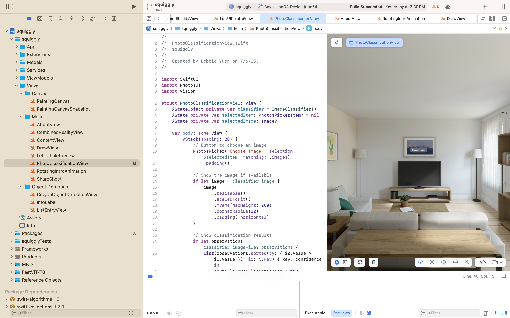

import { Steps } from 'nextra/components'
import { Callout } from 'nextra/components'

# Stroke Classification

## Getting Started 
<Steps>

### Step 1: PhotoClassificationView.swift
The project's folder structure is broken up into MVVM (Model-View-ViewModel) architecture. Navigate to `squiggly/Views/Main/PhotoClassificationView.swift`.

### Step 2: Photos Tab in Toolbar
On the Apple Vision Pros, you will find the toolbar on the left. In this window, we have 3 toolbars including the left toolbar, bottom toolbar, and the top ornament. Select the `Photos` Tab to open up the tab. 

### Step 3: Choose Photo
Once you are in the tab, you may try choosing a photo of your choice to classify. By default we are using Apple's built-in Vision Framework with `VNClassifyImageRequest()`. 

</Steps>

## Overview

## 